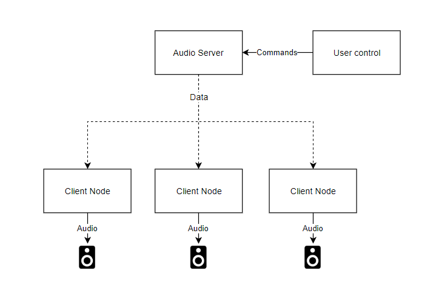
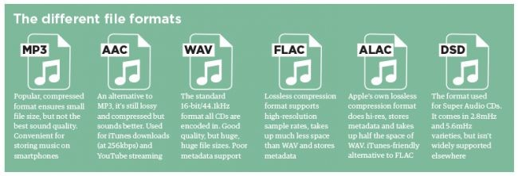
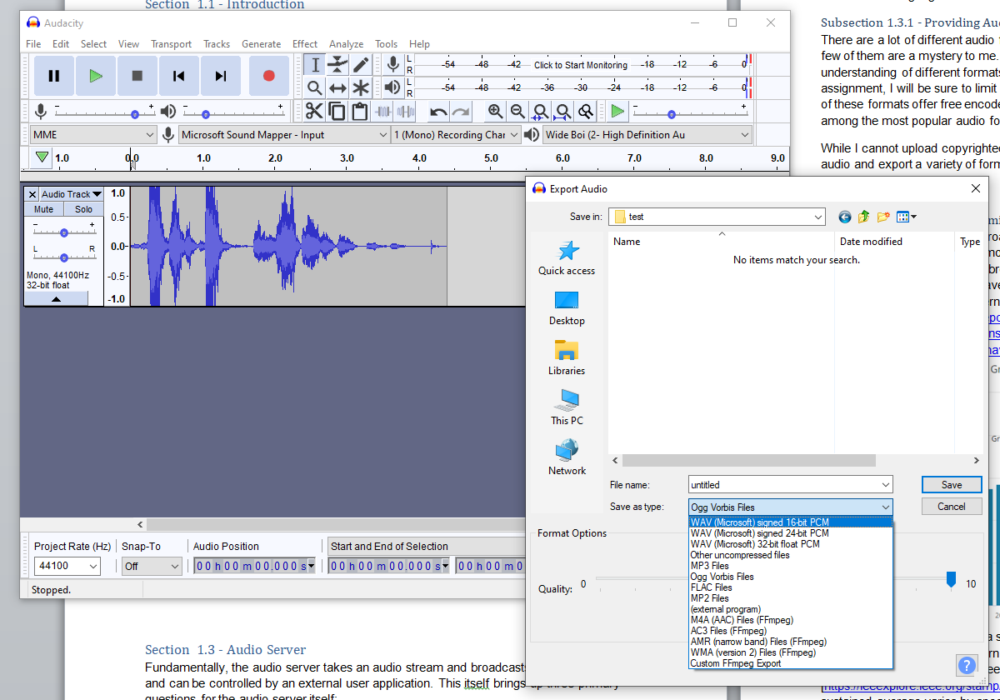
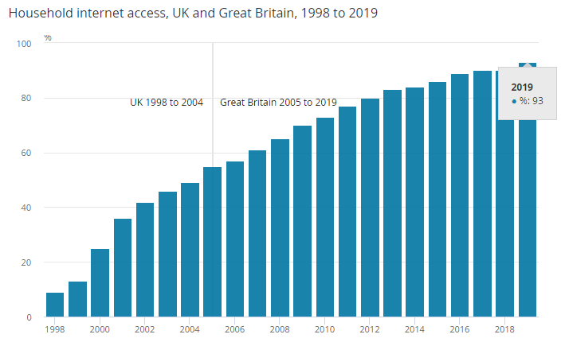

# 1. Just Another Speaker Link Network

[comment]: # (This document was made in VSCode with the following plugins:)
[comment]: # ( - Markdown All in One)
[comment]: # ( - Markdown Footnotes)
[comment]: # ( - Markdown TOC)

   

 [en: /jæs-l?n/]

 by nlovell.net

---

<!-- TOC -->

- [1. Just Another Speaker Link Network](#1-just-another-speaker-link-network)
  - [1.0.1. Project Context](#101-project-context)
  - [1.1. Literature Review](#11-literature-review)
    - [1.1.1. Introduction](#111-introduction)
    - [1.1.2. Approach Overview](#112-approach-overview)
  - [1.2. Audio Server](#12-audio-server)
    - [1.2.1. Providing Audio](#121-providing-audio)
    - [1.2.2. Data Transmission Technologies](#122-data-transmission-technologies)
    - [1.2.3. User Controls](#123-user-controls)
    - [1.2.4. Language Choices](#124-language-choices)
  - [1.3. Client Nodes](#13-client-nodes)
    - [1.3.1. Playing back Audio](#131-playing-back-audio)
    - [1.3.2. Playback synchronisation](#132-playback-synchronisation)
  - [1.4. Conclusion](#14-conclusion)

<!-- /TOC -->

---

## 1.0.1. Project Context  

Multi-Room audio is typically an expensive platform to run; a premium product, with a price tag to match. SONOS, the market leader in multi-room audio setups, has several different networked speaker options – however I have some issues with them.
SONOS pricing starts at £179 for their basic speakers, and £399 for just the streamer unit if you want to use your own. Along with this, usage of the SONOS platform is limited to their app on iOS and Android, with a desktop application available for Windows. The system is not platform agnostic.
And while alternative solutions exist, such as Naim’s Mu-so system or Audio Pro’s C-series, all sport the same critical issues that plague SONOS speakers. More cost-effective alternatives include Amazon Echo or Google Home, however these also have drawbacks for my specific application. Both providers offer average audio quality with limited customization options for audio playback, but a larger issue for my application is the always-on voice monitoring. This may be a convenience for some, but due to privacy concerns that surround such systems it isn’t a desirable feature.
Even alternative “_DIY_” solutions such as Max2Play have their drawbacks. The only platforms that are capable of multi-room audio are limited by an entry fee, and there aren’t any viable open source alternatives. As an advocate for free and open-source software, this is something I want to change.
I believe it would be feasible to develop my own solution capable of streaming high-quality audio within a local network, without the previously stated drawbacks. The cost per-node can be as low as £25 (plus speakers), which is significantly less than the £399 speaker-less SONOS configuration.

JASLiN will be a platform-agnostic web-controlled LAN-based multi-room audio solution without the cost or gimmicks associated with either Sonos or Echo type systems. After the duration of this assessment, JASLiN will be released as an open-source project –free to anyone on the internet to modify, update, and upgrade.

## 1.1.  Literature Review  

### 1.1.1. Introduction  

This project suggests the development of a client-server application controlled from a web-frontend to be ran on raspberry pi hardware, and this chapter serves to review available literature on surrounding technologies that could potentially be integrated into, or utilised to support the product.
This chapter will focus on three key elements – data transmission technologies, backend implementation technologies (including transcoding and handling communication between the UI and the hardware elements), and client playback and audio synchronisation strategies.

### 1.1.2. Approach Overview

Broadcasting audio over a local-area network is technically possible, and has been implemented several times already by standalone manufacturers such as SONOS and Google. From the top level, the system is fairly simple and can be approximated with the diagram as below, fig. 1; however understanding how any of these individual components will operate with each-other requires a deeper understanding of the technologies involved.

_Figure 1: Approximate Architecture_

## 1.2. Audio Server

Fundamentally, the audio server takes an audio stream and broadcasts it to client nodes, and can be controlled by an external user application. This brings up four primary questions for the audio server itself;

1. How will audio be provided to the system?
2. How will the system broadcast audio to the client nodes?
3. How will the user control the system?
4. What language will be used to develop this?

### 1.2.1. Providing Audio  

There are a lot of different audio formats which could be provided to the System, and very few of them are a mystery to me. As a hobbyist audiophile I have a deep personal understanding of different formats and their benefits and drawbacks. For the purpose of this assignment, I will be sure to limit my file compatibility testing to just MP3 and FLAC, as both of these formats offer free encoders and decoders for commercial use such as LAME for MP3 and Xiph for FLAC, along with being among the most popular audio formats worldwide.

 
_Figure 2: A summary of formats from WhatHifi (2019 [^6])_  
While I cannot upload copyrighted music within my code as file tests, I can generate my own audio to export a variety of formats to ensure compatibility. Legally, I can use my personal collection for testing without breaching any legislation.

 
_Figure 3: Generating my own audio_  
Unless I only provide an implementation for digital data files, Analogue to Digital conversion is an issue, and requires consideration for both hardware and software components. In this regard, either the hardware could drive the software choices, or the software could drive the hardware choices.

### 1.2.2. Data Transmission Technologies

There are several different approaches which I could take to transmitting the audio data - Digital Audio Broadcast—commonly referred to as “_DAB radios_”—have been around for a while, and offer one method of broadcasting audio. This does, however, have drawbacks in the fact that very few people have direct access to DAB radio hardware. In contrast, 93% of households in the UK have internet access (Prescott, 2019 [^5]).  

  
We can assume from this that a similar percentage of households host their own local-area network and WiFi router. Modern WiFi protocols, such as 802.11ac, allow for theoretical limits of 866.7Mbps transfer speeds according to the IEEE protocol specification (IEEE Standard for Information Technology, 2013 [^3]); however testing sustained average varies by specific application. One test conducted by Kaewkiriya (2017 [^4]) produces stable sustained bandwidths of 16.6 Mb/s, however Dolinska (et al, 2019 [^2]) tested 802.11ac successfully at 93.7 Mb/s. While it is a broad stroke to assume that approximately 90% of the UK have access to a LAN with 802.11ac WiFi connectivity, it should be fairly reasonable to assume the types of people interested in an esoteric open-source audio streaming platform would have this. An alternative would be Bluetooth – this does accommodate the master/slave architecture required of the proposed system, however there are limitations to this – including bandwidth, which is limited to 2 Mb/s according to the Bluetooth Core Specifications (Bluetooth.com, 2019 [^1]). While this would be acceptable for a single CD-quality audio stream, as this can be compressed to FLAC using LAME to approximately 800 Kb/s, it may struggle with higher resolution audio streams such as “_studio masters_” at 24-bit 96khz, or direct analogue streaming (such as from a turntable). This would make Bluetooth a poor choice for real-time data transfer.  
When using internet protocol to transmit data within a local network, there are several different transmission methods that could be utilised within an audio streaming context; User Datagram Protocol (UDP) and Transmission Control Protocol (TCP/IP) are two such examples. TCP embeds metadata within packets in order to ensure that all the packets are received in the order they are sent – for this to occur, especially on a wireless network which cannot guarantee perfect transmissions, timeouts and retransmission strategies are required. This adds overhead to the data transmissions, both in terms of time and the size of data being sent. For this reason, TCP is cited as a cumbersome protocol, and Vincent (2018 [^7]) describes the UDP protocol as “_more efficient than TCP and used for real-time communication (audio, video) […]_” and, as a result, “_[…] is preferable to the overhead of a TCP connection_”. This is backed up by section 6.3 of the AES Standards document for High-Performance streaming Audio-over-IP interoperability document (AES, 2015 [^10]) which states that devices shall use UDP in order to implement AES67 successfully.

### 1.2.3. User Controls

As technology grows, so does the number of available platforms; Windows, Mac, iOS, Android, and Linux to list just a few such platforms. If I want this application to be platform agnostic, there are two routes I could take.

1. Develop a cross-platform application using a service such as Xamarin, which allows the developer to produce a single application capable of deployment for different platforms
2. Develop an application that runs in a container, virtual machine, or service. This could be along the lines of Java (running in a host JVM), Docker (running in a hosted container) or a Web Application, which can be accessed from any standard web browser.

The former has the advantage of being able to interface directly with applications through types of remote method invocation; however Xamarin applications aren’t truly platform independent. They do, however, help abstract away platform-specific functionality and allow the developer to generate code that isn’t tethered to specific platforms, and allows installable applications to be created much more quickly. An added benefit of this is performance – Xamarin compiles to code native to the target platform, which is always better at leveraging hardware than running through a virtualised host, such as Java or Docker.  
The latter offers a greater level of flexibility, however may also result in functionality being stripped away – a web application in particular would be the ideal solution to this, as there is  

### 1.2.4. Language Choices

Considering platform agnosticism as the ultimate goal for this, it would only make sense to pick a language that is inherently platform agnostic – Java. Java runs in a virtual environment, and the Java code I produce won’t rely on the functionality of the host operating system. Along with this, it also offers the benefit of familiarity, as I already have some experience with Java. While it isn’t the most optimised platform, it does mean that I can develop and test the server software on Windows before deployment to the final hardware, such as a raspberry pi or a other Linux-based client.  

## 1.3. Client Nodes

Once the audio has been broadcast from the server, the client nodes have the role to interpret this information and play it back. This will, essentially, be comprised of three elements.  

1. Receiving/decoding the audio data
2. Playing the audio data  
3. Ensuring the audio is synchronised between nodes

### 1.3.1. Playing back Audio

Streaming audio data and playing it back in realtime would require a transcoder, and while my knowledge on how to produce one of these is limited, thankfully such technologies already exist – FFMPEG, the free audiovisual codec library, provides functionality for this already. (source: [FFMPEG Streaming Guide](https://trac.ffmpeg.org/wiki/StreamingGuide)) There may be alternatives to this; however I will not consider them. FFMPEG is a free and open-source codec, which is implemented by both freewares like MusicBee, and high-end audio playback software such as Jriver (Jriver 2019 [^9]). The hardware requirements for FFMPEG are minimal – while I cannot find any “_minimum specification_” officially published by the group, Whitmore (2011 [^8]) comments on this issue with “_I can run ffmpeg on my wireless router so it can really run on anything__”. This alleviates my concern for minimum running requirements for the codec in question.  

### 1.3.2. Playback synchronisation

While playing audio over a network, there are some considerations to be made as network latency may vary between devices, as a result of network congestion or other factors. There are several patented technologies and designs that aim to mitigate this issue, including patent US7333519B2 for “_manually fine tuning audio synchronization of a home network._” While it would be illegal to replicate such designs, I believe am allowed to take inspiration from such works.

## 1.4. Conclusion

I struggled to find resources that may explicitly assist in the development of this project, and spent a lot of time trying to find relevant resources in order to make informed decisions as to how to progress the development of this project. Unfortunately, this area – despite being widely used – appears to lack any significant publications that I could find online. 
What I did discover, however, was that UDP streaming over a WiFi LAN while using FFMPEG as the encoding/decoding engine is likely the best route forward for reasonable performance and practical implementation, and adhering to the AES67 specification will give this project a better chance of succeeding from an audio streaming perspective.

[^1]: Bluetooth.com. (2019). 211. [online] Available at: [https://www.bluetooth.org/docman/handlers/downloaddoc.ashx?doc_id=457080](https://www.bluetooth.org/docman/handlers/downloaddoc.ashx?doc_id=457080)[Accessed 16 Nov. 2019].
[^2]: Dolinska, I., Jakubowski, M. and Masiukiewicz, A. (2019). 2019 International Conference on Information and Digital Technologies (IDT). IEEE, p.122.
[^3]: IEEE standard for information technology. (2013). IEEE, p.332.  
[^4]: Kaewkiriya, T. (2017). 2017 2nd International Conference on Communication Systems, Computing and IT Applications (CSCITA). [S.l.]: IEEE, p.238.  
[^5]: Prescott, C. (2019). Internet access – households and individuals, Great Britain - Office for National Statistics. [online] Ons.gov.uk. Available at: [https://www.ons.gov.uk/peoplepopulationandcommunity/householdcharacteristics/homeinternetandsocialmediausage/bulletins/internetaccesshouseholdsandindividuals/2019#almost-two-thirds-of-households-now-have-mobile-broadband-access](https://www.ons.gov.uk/peoplepopulationandcommunity/householdcharacteristics/homeinternetandsocialmediausage/bulletins/internetaccesshouseholdsandindividuals/2019#almost-two-thirds-of-households-now-have-mobile-broadband-access) [Accessed 16 Nov. 2019].  
[^6]: Scarrott, B. (2019). MP3, AAC, WAV, FLAC: all the audio file formats explained. [online] whathifi. Available at: [https://www.whathifi.com/advice/mp3-aac-wav-flac-all-the-audio-file-formats-explained](https://www.whathifi.com/advice/mp3-aac-wav-flac-all-the-audio-file-formats-explained) [Accessed 16 Nov. 2019].
[^7]: Vincent, W. (2018). TCP vs UDP - William Vincent. [online] Wsvincent.com. Available at: [https://wsvincent.com/tcp-vs-udp/](https://wsvincent.com/tcp-vs-udp/) [Accessed 16 Nov. 2019].  
[^8]: Whitmore, C. (2011). [FFmpeg-user] Min Hardware Requirements. [online] ffmpeg.org. Available at: [https://ffmpeg.org/pipermail/ffmpeg-user/2011-March/000094.html](https://ffmpeg.org/pipermail/ffmpeg-user/2011-March/000094.html) [Accessed 16 Nov. 2019].
[^9]: Wiki.jriver.com. (2019). Release Notes MC24 - JRiverWiki. [online] Available at: [https://wiki.jriver.com/index.php/Release_Notes_MC24](https://wiki.jriver.com/index.php/Release_Notes_MC24) [Accessed 16 Nov. 2019].
[^10]: AES, 2015. AES standard for audio applications of networks - High-performance streaming audio-over-IP interoperability, AES, viewed 01 October 2019, [http://www.aes.org/standards/comments/drafts/aes67-r-171107-draft-rev-cfc.pdf](http://www.aes.org/standards/comments/drafts/aes67-r-171107-draft-rev-cfc.pdf)
